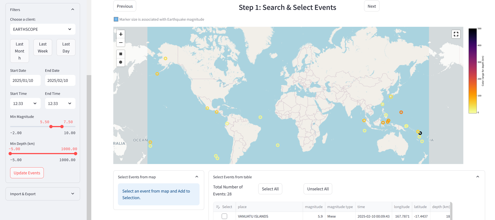

# SEED-vault



#### SEED Vault is a cross platform GUI utility which can search, view and download seismic data from FDSN servers

- Download & view EQ arrival data via a station-to-event OR an event-to-station search
- Quickly download and archive bulk continuous data, saving your progress along the way
- View and plot event arrivals
- A CLI scripting tool to automate common jobs
- Search, export, or import earthquake event catalogs and station metadata and network references in BibTeX
- Download restricted/embargoed data by storing auth passwords in local config
- Add and use custom FDSN servers
- Saves all downloaded data as miniseed in a local SDS database to speed up future retrievals
- Local sqlite3 database editor
- Load, save, export, and share search parameters and configuration

Runs on:

- Linux
- Windows
- MacOS

Can run:

- As web service
- From the command line (CLI)

#### User Guide & Reference

https://auscope.github.io/seed-vault

https://pubs.geoscienceworld.org/ssa/srl/article/doi/10.1785/0220250167/727708/SEED-Vault-A-New-Software-Package-for-Browsing (appreciate the cite if you find this useful!)

---

### Requirements

- 8 GB RAM
- Python >= 3.10, tested up to 3.14
- ObsPy (>=1.5.0), Streamlit (>=1.55), Plotly (>-5.24), Pandas (>=2.2.2), Matplotlib (>=3.8.5)

# Install via pip (easy way)

```
python3 -m pip install seed-vault
```

NB:

1. If you get an *"error: externally-managed-environment"* error, you will need to install and activate a new Python environment
   
    e.g.
    ```
    python3 -m venv ./venv
    . ./venv/bin/activate
    ```

4. Assumes python & 'pip', 'venv' packages are installed

    e.g. for Ubuntu, as root:
    ```
    apt update
    apt install -y python3 python3-dev python3-pip python3-venv
    ```

# Install from source (if you insist!)

### Step 1: Clone repository

```bash
git clone https://github.com/AuScope/seed-vault.git
```

### Step 2: Setup and run

Then can build via pip:

```
python3 -m pip install ./seed-vault

OR to install current master version

python3 -m pip install git+https://github.com/AuScope/seed-vault.git
```

Or,

```
#### Linux/MacOS
cd seed-vault
source setup.sh
source run.sh
```

#### Windows

Open a powershell and run following commands:

```
cd seed-vault
.\setup-win.ps1
.\run-win.ps1
```

**NOTES:**

1. Requires get, sudo & python3 software packages

   e.g. for Ubuntu you may need install (as root):
   ```
   apt update
   apt install -y git sudo
   apt install -y python3 python3-dev python3-pip python3-venv
   ```

## Project Folder structure

```
seed-vault/
│
├── seed_vault/      # Python package containing application code
│   ├── docs/          # Documentation
│   ├── models/        # Python modules for data models
│   ├── scripts/       # Example CLI scripts
│   ├── service/       # Services for logic and backend processing
│   ├── tests/         # Test data and utilities
│   ├── ui/            # UI components (Streamlit files)
│   ├── utils/         # Utility functions and helpers
│
└── pyproject.toml     # Project configuration file
```
