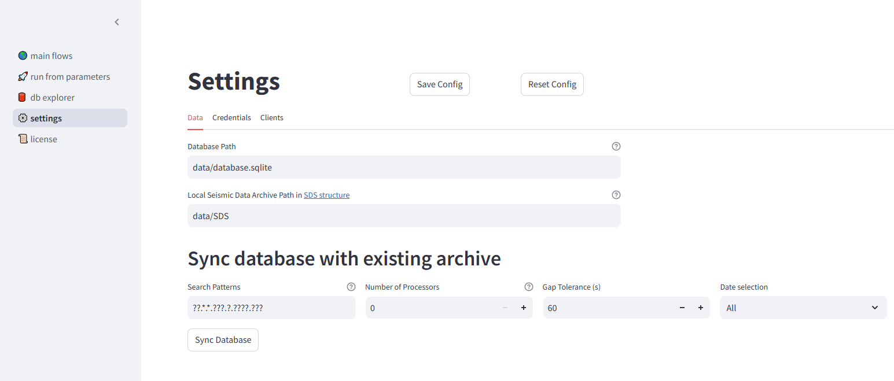

App Settings
============

The **App Settings** page allows users to configure various application settings.

   Settings page.

The figure above provides an overview of the settings page, which consists of three main tabs:

- **Data**
- **Credentials**
- **Clients**

.. warning::

   Changes made to the settings are **not automatically saved**. Make sure to click the **Save Config** button to apply your modifications.

Data
----

The **Data** tab manages storage settings, which include:

1. **Archiving Database** – Tracks downloaded data and stores metadata about queries.
2. **Seismic Data Storage** – Defines the local storage path for seismic time series.

The archiving database prevents unnecessary re-downloads by maintaining a record of previously acquired data.

Parameters
^^^^^^^^^^

**Database Path:** The database storage path. If the path does not start with ``/``, it is considered **relative** to the ``seed-vault`` installation directory.

To specify a parent directory, use ``../``. For example:

- ``../data/database.sqlite`` stores the database in the parent directory of ``seed-vault``.

For stability, it is **recommended to use an absolute path**.

**Data Archive Path:** Defines where seismic data is stored. Similar to the **Database Path**, an absolute path is recommended.

Moving Data to Another Location
"""""""""""""""""""""""""""""""
If you need to move your data to a new location, follow these steps:

1. Move your **seismic data** to the new location.
2. Move your **database** to the new location.
3. In the **Settings** page, update the *Database Path* and *Data Archive Path* with the new locations.
4. Click **Save Config** to apply the changes.

Syncing Database with Existing Archive
"""""""""""""""""""""""""""""""""""""""

This section allows users to populate the **archiving database** from existing local seismic data. If you already have seismic files, syncing ensures they are indexed in the database, preventing unnecessary re-downloads.

Parameters
^^^^^^^^^^

- **Search Patterns** – File patterns to match. Defaults to ``["??.*.*.???.?.????.???"]`` (standard SDS naming pattern).
- **Number of Processors** – Number of parallel processes used for syncing.
- **Gap Tolerance** – Maximum time gap (in seconds) between segments considered continuous. Defaults to **60s**.
- **Date Selection** – Defines the starting date for adding traces to the database.

Credentials
-----------

.. figure:: _static/images/settings_2.png
   :alt: credentials image

   Credentials tab.

The **Credentials** tab allows users to store authentication details required for accessing restricted datasets. **All credentials are stored locally on your machine.**

Adding & Removing Credentials
^^^^^^^^^^^^^^^^^^^^^^^^^^^^^
- Click **Add Credential Set** to add a new credential.
- Click **Delete** to remove an existing credential.

Parameters
^^^^^^^^^^^
- **N.S.L.C Code** – Represents the `<network>.<station>.<location>.<channel>` code. The level of access determines how much of the code needs to be specified:
  - **Network-level access** → Enter only the **network** code.
  - **Station-level access** → Enter the **network** and **station** codes.

- **Username** – Your authentication username.
- **Password** – Your authentication password.

After making changes, click **Save Config** to apply them.

Clients
-------

   Clients tab.

The **Clients** tab allows users to add custom clients that are **not included** in ObsPy's default client list. 

For more details on existing clients, see the official ObsPy documentation: `ObsPy FDSN Clients <https://docs.obspy.org/packages/obspy.clients.fdsn.html>`_.

Managing Extra Clients
"""""""""""""""""""""""

- Use the **Extra Clients** section to add new clients by specifying a **name** and **URL**.
- To delete an extra client, tick the box next to it and click **Delete**.

On the **right side of the page**, you will find a list of currently available clients.