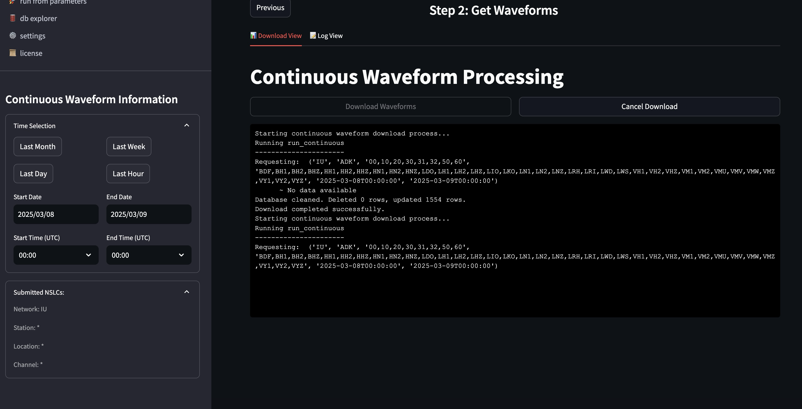

Continuous Based
===============

This workflow focuses on downloading continuous time series data from seismic stations, independent of specific earthquake events.

Overview
--------

The Continuous Based workflow is designed for retrieving and analyzing continuous data streams from seismic stations. Unlike the event-based approaches, this workflow is not tied to specific earthquake events but instead focuses on time series data over specified time periods.

Workflow Steps
-------------

1. **Select Stations**: Navigate to the station page to choose seismic stations based on criteria such as network, location, or operational parameters
2. **Download Continuous Data**: Go to the continuous data download page to retrieve time series data for the selected stations over specified time periods

This workflow is particularly useful for:

* Background noise analysis
* Long-term station monitoring
* Detecting subtle seismic signals not associated with cataloged events
* Creating training datasets for machine learning applications
* Ambient seismic field studies

Step 1: Search & Select Stations
-------------------------------

The station selection interface for the continuous-based workflow is identical to the one in the station-based workflow. Please refer to the :doc:`station_based` documentation for detailed information about this step.

After selecting your stations, click the "Next" button to proceed to the continuous data download step.

Step 2: Download Continuous Data
------------------------------

   
   Continuous waveform processing interface showing download controls and log view

The continuous data download interface allows you to retrieve time series data for your selected stations over specified time periods:

**Time Selection**:

.. include:: ../shared/time_filters.rst
   :start-after: Time Filtering
   :end-before: **Time (UTC) Selection**

   * Specify precise start and end times (UTC)

**Station Filtering**:
   * View and confirm the selected Network, Station, Location, and Channel codes
   * These are pre-populated based on your selections from Step 1

**Download Process**:
   * Click "Download Waveforms" to start the retrieval process
   * View real-time progress in the log view
   * Cancel the download if needed
   * Toggle between Download View and Log View to monitor progress

**Technical Details**:
   * The system uses the `run_continuous` function from the seismoloader module to process the request
   * Data is requested for all selected network-station-location-channel (NSLC) combinations
   * The process handles data in chunks to manage memory efficiently
   * Downloaded data is stored in SeisComP Data Structure (SDS) format in the local database
   * The system tracks progress and can resume interrupted downloads

**Log Information**:
   * View detailed information about the download process
   * See which channels are being requested
   * Monitor database operations
   * Confirm successful completion of downloads

Unlike the event-based workflows, the continuous data download does not provide waveform visualization directly in this interface. The focus is on efficiently downloading and archiving large volumes of continuous data that can be accessed later for analysis.

Key Features
-----------

* Continuous data stream processing
* Flexible time range selection
* Multi-channel data retrieval
* Efficient storage in SDS (SeisComP Data Structure) format
* Progress tracking for large downloads
* Resume capability for interrupted downloads 