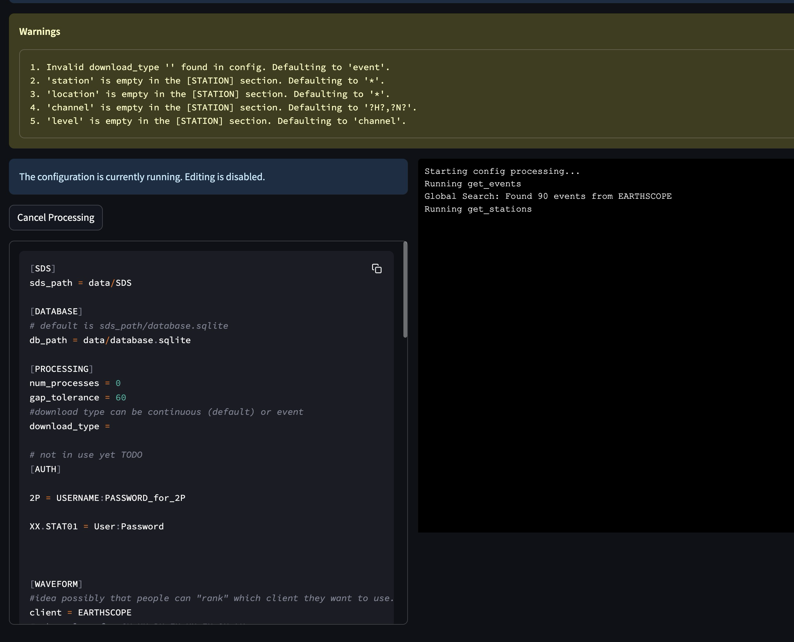

Direct parameter input
=================

This workflow allows execution of operations using saved or predefined parameter sets, enabling automated and reproducible data processing without interactive selection.

Overview
--------

The Run from Parameters workflow enables users to execute operations using configuration files rather than interactive selection. This approach provides automation and reproducibility for various seismic data processing tasks, allowing users to quickly run common workflows without manual configuration.

References and Documentation
---------------------------

The parameters used in this workflow are based on standard FDSN web service specifications:

**Station Parameters** (for searching seismic stations)
   * `FDSN Station Web Service Specification <https://www.fdsn.org/webservices/fdsnws-station-1.1.pdf>`_
   * `FDSN Station GitHub Repository <https://github.com/FDSN/fdsnws-station>`_
   * `AusPass Station Service Example <https://auspass.edu.au/fdsnws/station/1/>`_

**Event Parameters** (for searching earthquakes)
   * `FDSN Event Web Service Specification <http://www.fdsn.org/webservices/fdsnws-event-1.2.pdf>`_
   * `FDSN Event GitHub Repository <https://github.com/FDSN/fdsnws-event>`_
   * `AusPass Event Service Example <https://auspass.edu.au/fdsnws/event/1/>`_

**Dataselect Parameters** (for searching waveform data)
   * `FDSN Dataselect Web Service Specification <http://www.fdsn.org/webservices/fdsnws-dataselect-1.1.pdf>`_
   * `FDSN Dataselect GitHub Repository <https://github.com/FDSN/fdsnws-dataselect>`_
   * `AusPass Dataselect Service Example <https://auspass.edu.au/fdsnws/dataselect/1/>`_

Workflow Steps
-------------

Unlike the other workflows that require multiple interactive steps, the Run from Parameters workflow consists of a single step:

1. **Load and Execute Configuration**: Load a configuration file containing predefined parameters and execute the corresponding process

This workflow is particularly useful for:

* Batch processing of multiple datasets
* Reproducible research workflows
* Automated data collection routines
* Scheduled data retrieval tasks
* Sharing processing configurations with colleagues

Step 1: Load and Execute Configuration
------------------------------------

   
   Run from Parameters interface showing configuration and execution log

The Run from Parameters interface allows you to execute seismic data operations using predefined configuration files:

**Configuration Display**:
   * View the currently loaded configuration file
   * See warnings about missing or default parameters
   * Configuration sections include:
     * [SDS] - Path settings for SeisComP Data Structure
     * [DATABASE] - Database connection settings
     * [PROCESSING] - Processing parameters like number of processes and gap tolerance
     * [AUTH] - Authentication credentials for restricted data access
     * [WAVEFORM] - Client selection and other waveform parameters

**Execution Controls**:
   * The configuration is automatically executed when loaded
   * "Cancel Processing" button to stop the execution
   * Real-time log output showing the progress of the operation

**Log Information**:
   * View detailed information about the execution process
   * See which operations are being performed (e.g., `get_events`, `get_stations`)
   * Monitor the results of each operation
   * Track overall progress of the workflow

**Technical Details**:
   * The system reads parameters directly from the configuration file
   * Parameters can specify event criteria, station selection, time windows, etc.
   * The system automatically determines whether to run event-based or continuous-based processing
   * Processing follows the same underlying logic as the interactive workflows
   * Results are stored in the same database and file structure as other workflows

This workflow effectively bypasses the interactive selection steps of the other workflows, allowing for automated execution based on predefined parameters.

Key Features
-----------

* Parameter-driven execution
* Configuration file-based operation
* Command-line interface (CLI) support for scripting
* Automated processing without user interaction
* Detailed logging of processing steps
* Support for both event-based and continuous data retrieval 

.. _parameter-reference:

Parameter Reference
-------------------
.. raw:: html

   <!DOCTYPE html>
   <html lang="en">
   <head>
      <meta charset="UTF-8" />
      <meta name="viewport" content="width=device-width, initial-scale=1.0" />
      <title>Configuration Table</title>
      <link
         href="https://fonts.googleapis.com/css2?family=Roboto:wght@300;400;700&display=swap"
         rel="stylesheet"
      />
      
   </head>
   <body>
      <table>
         <thead>
         <tr>
            <th style="border: 1px solid black; padding: 8px; text-align: center">
               Sec.
            </th>
            <th style="border: 1px solid black; padding: 8px">Parameter</th>
            <th style="border: 1px solid black; padding: 8px; width: 40%">
               Description
            </th>
            <th style="border: 1px solid black; padding: 8px">Examples</th>
         </tr>
         </thead>
         <tbody>
         <tr>
            <td
               style="
               border: 1px solid black;
               padding: 8px;
               writing-mode: vertical-rl;
               text-align: center;
               background-color: #f2f2f2;
               "
               rowspan="2"
            >
               DATA
            </td>
            <td style="border: 1px solid black; padding: 8px">sds_path</td>
            <td
               style="border: 1px solid black; padding: 8px; word-wrap: break-word"
            >
               Path to the SDS archive where waveform data is stored. Both relative
               and absolute paths can be defined. Relative path is considered from
               the location where you run seed-vault.
            </td>
            <td style="border: 1px solid black; padding: 8px">
               <strong>Relative paths:</strong>
               <ul>
               <li><code>data/sds</code></li>
               <li><code>../data/sds</code></li>
               </ul>
               <strong>Absolute paths:</strong>
               <ul>
               <li><code>/data/sds</code></li>
               <li><code>C:\data\sds</code></li>
               </ul>
            </td>
         </tr>
         <tr>
            <td style="border: 1px solid black; padding: 8px">db_path</td>
            <td
               style="border: 1px solid black; padding: 8px; word-wrap: break-word"
            >
               Path to the SQLite database file. Both relative and absolute paths
               can be defined. Relative path is considered from the location where
               you run seed-vault.
            </td>
            <td style="border: 1px solid black; padding: 8px">
               <strong>Relative paths:</strong>
               <ul>
               <li><code>data/sds</code></li>
               <li><code>../data/sds</code></li>
               </ul>
               <strong>Absolute paths:</strong>
               <ul>
               <li><code>/data/sds</code></li>
               <li><code>C:\data\sds</code></li>
               </ul>
            </td>
         </tr>
         <tr>
            <td
               style="
               border: 1px solid black;
               padding: 8px;
               writing-mode: vertical-rl;
               text-align: center;
               background-color: #f2f2f2;
               "
               rowspan="3"
            >
               PROCESSING
            </td>
            <td style="border: 1px solid black; padding: 8px">num_processes</td>
            <td
               style="border: 1px solid black; padding: 8px; word-wrap: break-word"
            >
               Number of processes used for parallel processing. This parameter is
               only used when syncing the database<a href="#footnote1">[1]</a>. Set to <strong>zero</strong> to use all available processes.
            </td>
            <td style="border: 1px solid black; padding: 8px">
               <code>0 (all processors)</code> 
               <code>4 (limit processors)</code>
            </td>
         </tr>
         <tr>
            <td style="border: 1px solid black; padding: 8px">gap_tolerance</td>
            <td
               style="border: 1px solid black; padding: 8px; word-wrap: break-word"
            >
               Maximum allowed gap in seconds before a warning is issued. This is
               useful for segmentation of the signals. The
               <code>gap</code> controls the time difference between two
               consecutive data points to be considered as one signal.
            </td>
            <td style="border: 1px solid black; padding: 8px"><code>10</code></td>
         </tr>
         <tr>
            <td style="border: 1px solid black; padding: 8px">download_type</td>
            <td
               style="border: 1px solid black; padding: 8px; word-wrap: break-word"
            >
               Defines whether data is downloaded continuously or by event.
            </td>
            <td style="border: 1px solid black; padding: 8px">
               <code>continuous | event</code>
            </td>
         </tr>
         <tr>
            <td
               style="
               border: 1px solid black;
               padding: 8px;
               writing-mode: vertical-rl;
               text-align: center;
               background-color: #f2f2f2;
               "
               rowspan="1"
            >
               AUTH (Optional)
            </td>
            <td style="border: 1px solid black; padding: 8px">NSLC code</td>
            <td
               style="border: 1px solid black; padding: 8px; word-wrap: break-word"
            >
               There is no allocated parameter name for AUTHs. Rather, AUTH lines
               should be formatted as below: 
               <code>{nslc code} = {username}:{password}</code> 
               where, nslc code is the
               <code>{network}.{station}.{location}.{channel}</code> code.
            </td>
            <td style="border: 1px solid black; padding: 8px">
               <code>AU.MT01 = USER:PASS</code>
            </td>
         </tr>
         <tr>
            <td
               style="
               border: 1px solid black;
               padding: 8px;
               writing-mode: vertical-rl;
               text-align: center;
               background-color: #f2f2f2;
               "
               rowspan="4"
            >
               WAVEFORM
            </td>
            <td style="border: 1px solid black; padding: 8px">client</td>
            <td
               style="border: 1px solid black; padding: 8px; word-wrap: break-word"
            >
               FDSN client used for waveform retrieval.
            </td>
            <td style="border: 1px solid black; padding: 8px">
               <code>EARTHSCOPE</code>
            </td>
         </tr>
         <tr>
            <td style="border: 1px solid black; padding: 8px">channel_pref</td>
            <td
               style="border: 1px solid black; padding: 8px; word-wrap: break-word"
            >
               Preferred channels for data retrieval.
            </td>
            <td style="border: 1px solid black; padding: 8px">
               <code>HHZ,EHZ</code>
            </td>
         </tr>
         <tr>
            <td style="border: 1px solid black; padding: 8px">
               force_redownload
            </td>
            <td
               style="border: 1px solid black; padding: 8px; word-wrap: break-word"
            >
               Forces re-downloading of waveforms, evenif they are already
               available locally and registered in the database.
            </td>
            <td style="border: 1px solid black; padding: 8px">
               <code>True | False</code>
            </td>
         </tr>
         <tr>
            <td style="border: 1px solid black; padding: 8px">
               days_per_request
            </td>
            <td
               style="border: 1px solid black; padding: 8px; word-wrap: break-word"
            >
               Set maximum number of days per data request.
            </td>
            <td style="border: 1px solid black; padding: 8px"><code>4</code></td>
         </tr>
         <tr>
            <td style="border: 1px solid black; padding: 8px">
               stations_per_request
            </td>
            <td
               style="border: 1px solid black; padding: 8px; word-wrap: break-word"
            >
               Set maximum number of simultaneous stations per data request.
            </td>
            <td style="border: 1px solid black; padding: 8px"><code>1</code></td>
         </tr>         
         <!-- STATION SECTION  -->
         <!--===============================================-->
         <tr>
            <td
               style="
               border: 1px solid black;
               padding: 8px;
               writing-mode: vertical-rl;
               text-align: center;
               background-color: #f2f2f2;
               "
               rowspan="26"
            >
               STATION
            </td>
            <td style="border: 1px solid black; padding: 8px">client</td>
            <td
               style="border: 1px solid black; padding: 8px; word-wrap: break-word"
            >
               FDSN client used for station metadata retrieval. If not defined, it
               will default to the <strong>waveform</strong> client.
            </td>
            <td style="border: 1px solid black; padding: 8px">
               <code>EARTHSCOPE</code>
            </td>
         </tr>
         <tr>
            <td style="border: 1px solid black; padding: 8px">local_inventory</td>
            <td
               style="border: 1px solid black; padding: 8px; word-wrap: break-word"
            >
            if set, will get the stations defined solely by the contents of this inventory file
            </td>
            <td style="border: 1px solid black; padding: 8px"><code>{path-to-inventory-file}</code></td>
         </tr>

         <tr>
            <td style="border: 1px solid black; padding: 8px">force_stations</td>
            <td
               style="border: 1px solid black; padding: 8px; word-wrap: break-word"
            >
            force-add these stations to the inventory at the same time (possibly outside of the search)
            </td>
            <td style="border: 1px solid black; padding: 8px"><code>IU.ADK.00.HH2</code></td>
         </tr>
         <tr>
            <td style="border: 1px solid black; padding: 8px">exclude_stations</td>
            <td
               style="border: 1px solid black; padding: 8px; word-wrap: break-word"
            >
            Use this parameter if you don't want some stations regardless of anything.
            </td>
            <td style="border: 1px solid black; padding: 8px"><code>IU.ADK</code></td>
         </tr>

         <tr>
            <td style="border: 1px solid black; padding: 8px">
               highest_samplerate_only
            </td>
            <td
               style="border: 1px solid black; padding: 8px; word-wrap: break-word"
            >
               If True, retrieves only the highest sample rate available.
            </td>
            <td style="border: 1px solid black; padding: 8px">
               <code>True | False</code>
            </td>
         </tr>
         
         <tr>
            <td style="border: 1px solid black; padding: 8px">starttime</td>
            <td
               style="border: 1px solid black; padding: 8px; word-wrap: break-word"
            >
            Searches for stations that were in operation after this time.
            </td>
            <td style="border: 1px solid black; padding: 8px"><code>2024-08-20</code></td>
         </tr>
         <tr>
            <td style="border: 1px solid black; padding: 8px">endtime</td>
            <td
               style="border: 1px solid black; padding: 8px; word-wrap: break-word"
            >
            Searches for stations that were in operation before this time.
            </td>
            <td style="border: 1px solid black; padding: 8px"><code>2024-09-20</code></td>
         </tr>
         <tr style="background-color: orange;">
            <td style="border: 1px solid black; padding: 8px">startbefore</td>
            <td
               style="border: 1px solid black; padding: 8px; word-wrap: break-word"
            >
            Searches for stations that their commissioning was before this time.
            </td>
            <td style="border: 1px solid black; padding: 8px"><code>1990-01-20</code></td>
         </tr>
         <tr style="background-color: orange;">
            <td style="border: 1px solid black; padding: 8px">startafter</td>
            <td
               style="border: 1px solid black; padding: 8px; word-wrap: break-word"
            >
            Searches for stations that their commissioning was after this time.
            </td>
            <td style="border: 1px solid black; padding: 8px"><code>1990-01-20</code></td>
         </tr>
         <tr style="background-color: orange;">
            <td style="border: 1px solid black; padding: 8px">endbefore</td>
            <td
               style="border: 1px solid black; padding: 8px; word-wrap: break-word"
            >
            Searches for stations that their de-commissioning was before this time.
            </td>
            <td style="border: 1px solid black; padding: 8px"><code>1990-01-20</code></td>
         </tr>
         <tr style="background-color: orange;">
            <td style="border: 1px solid black; padding: 8px">endafter</td>
            <td
               style="border: 1px solid black; padding: 8px; word-wrap: break-word"
            >
            Searches for stations that their de-commissioning was after this time.
            </td>
            <td style="border: 1px solid black; padding: 8px"><code>1990-01-20</code></td>
         </tr>
         

         <tr >
            <td style="border: 1px solid black; padding: 8px">network</td>
            <td
               style="border: 1px solid black; padding: 8px; word-wrap: break-word"
            >
               Network code(s) to filter stations. If not defined, it defaults to '*' which means all. 
            </td>
            <td style="border: 1px solid black; padding: 8px"><code>AU</code></td>
         </tr>
         <tr>
            <td style="border: 1px solid black; padding: 8px">station</td>
            <td
               style="border: 1px solid black; padding: 8px; word-wrap: break-word"
            >
               Specific station code(s) to retrieve. If not defined, it defaults to '*' which means all.
            </td>
            <td style="border: 1px solid black; padding: 8px">
               <code>MT01,ADK</code>
            </td>
         </tr>
         <tr>
            <td style="border: 1px solid black; padding: 8px">location</td>
            <td
               style="border: 1px solid black; padding: 8px; word-wrap: break-word"
            >
               Specific location code(s) to retrieve. If not defined, it defaults to '*' which means all.
            </td>
            <td style="border: 1px solid black; padding: 8px">
               <code>00.10</code>
            </td>
         </tr>
         <tr>
            <td style="border: 1px solid black; padding: 8px">channel</td>
            <td
               style="border: 1px solid black; padding: 8px; word-wrap: break-word"
            >
               Specific channel code(s) to retrieve. If not defined, it defaults to '*' which means all.
            </td>
            <td style="border: 1px solid black; padding: 8px">
               <code>HH2,BH1 | ?HH?</code>
            </td>
         </tr>
         

         <tr>
            <td style="border: 1px solid black; padding: 8px">geo_constraint</td>
            <td
               style="border: 1px solid black; padding: 8px; word-wrap: break-word"
            >
               Type of geographical constraint (bounding box | circle | None). This block
               confines the search area for stations.   
               <strong>Note:</strong> if geo_constraint block is not defined, the app will search stations globally.
            </td>
            <td style="border: 1px solid black; padding: 8px">
               <code>bounding | circle | None</code>
            </td>
         </tr>
         <tr>
            <td style="border: 1px solid black; padding: 8px">minlatitude</td>
            <td
               style="border: 1px solid black; padding: 8px; word-wrap: break-word"
            >
               Minimum latitude for bounding box constraint. (only applicable if <code>geo_constraint = bounding</code>)
            </td>
            <td style="border: 1px solid black; padding: 8px"><code>-35.0</code></td>
         </tr>
         <tr>
            <td style="border: 1px solid black; padding: 8px">maxlatitude</td>
            <td
               style="border: 1px solid black; padding: 8px; word-wrap: break-word"
            >
               Maximum latitude for bounding box constraint. (only applicable if <code>geo_constraint = bounding</code>)
            </td>
            <td style="border: 1px solid black; padding: 8px"><code>-30.0</code></td>
         </tr>
         <tr>
            <td style="border: 1px solid black; padding: 8px">minlongitude</td>
            <td
               style="border: 1px solid black; padding: 8px; word-wrap: break-word"
            >
               Minimum longitude for bounding box constraint. (only applicable if <code>geo_constraint = bounding</code>)
            </td>
            <td style="border: 1px solid black; padding: 8px"><code>130.0</td>
         </tr>
         <tr>
            <td style="border: 1px solid black; padding: 8px">maxlongitude</td>
            <td
               style="border: 1px solid black; padding: 8px; word-wrap: break-word"
            >
               Maximum longitude for bounding box constraint. (only applicable if <code>geo_constraint = bounding</code>)
            </td>
            <td style="border: 1px solid black; padding: 8px"></code>140.0</code></td>
         </tr>
         
         <tr>
            <td style="border: 1px solid black; padding: 8px">latitude</td>
            <td
               style="border: 1px solid black; padding: 8px; word-wrap: break-word"
            >
               Latitdue position of the center of the circle. (only applicable if <code>geo_constraint = circle</code>)
            </td>
            <td style="border: 1px solid black; padding: 8px"><code>-30.0</code></td>
         </tr>
         <tr>
            <td style="border: 1px solid black; padding: 8px">longitude</td>
            <td
               style="border: 1px solid black; padding: 8px; word-wrap: break-word"
            >
            Longitude position of the center of the circle. (only applicable if <code>geo_constraint = circle</code>)
            </td>
            <td style="border: 1px solid black; padding: 8px"><code>140.0</code></td>
         </tr>
         <tr>
            <td style="border: 1px solid black; padding: 8px">minsearchradius</td>
            <td
               style="border: 1px solid black; padding: 8px; word-wrap: break-word"
            >
               Minimum search radius distance (in degrees). The app searches areas between min and max search radii. (only applicable if <code>geo_constraint = circle</code>)
            </td>
            <td style="border: 1px solid black; padding: 8px"></code>140.0</code></td>
         </tr>
         <tr>
            <td style="border: 1px solid black; padding: 8px">maxsearchradius</td>
            <td
               style="border: 1px solid black; padding: 8px; word-wrap: break-word"
            >
            Maximum search radius distance (in degrees). The app searches areas between min and max search radii. (only applicable if <code>geo_constraint = circle</code>)
            </td>
            <td style="border: 1px solid black; padding: 8px"></code>140.0</code></td>
         </tr>
         <tr style="background-color: orange;">
            <td style="border: 1px solid black; padding: 8px">includerestricted</td>
            <td
               style="border: 1px solid black; padding: 8px; word-wrap: break-word"
            >
                Specify if results should include information for restricted stations.
            </td>
            <td style="border: 1px solid black; padding: 8px"><code>True</code></td>
         </tr>
         <tr>
            <td style="border: 1px solid black; padding: 8px">level</td>
            <td
               style="border: 1px solid black; padding: 8px; word-wrap: break-word"
            >
            This parameter controls the stations are retrieved at what level. If set to <code>station</code> it will only get the stations. If set to <code>channel</code> it would retrieve at channel level. Default value is <code>channel</code>
            </td>
            <td style="border: 1px solid black; padding: 8px"></code>station | channel</code></td>
         </tr>
         <!-- EVENT SECTION  -->
         <!--===============================================-->
         <tr>
            <td
               style="
               border: 1px solid black;
               padding: 8px;
               writing-mode: vertical-rl;
               text-align: center;
               background-color: #f2f2f2;
               "
               rowspan="33"
            >
               EVENT (Optional)
            </td>
            <td style="border: 1px solid black; padding: 8px">client</td>
            <td
               style="border: 1px solid black; padding: 8px; word-wrap: break-word"
            >
               FDSN client used for event data retrieval. If not defined it will default to <strong>waveform</strong> client.
            </td>
            <td style="border: 1px solid black; padding: 8px"><code>USGS</code></td>
         </tr>
         <tr style="background-color: orange;">
            <td style="border: 1px solid black; padding: 8px">model</td>
            <td
               style="border: 1px solid black; padding: 8px; word-wrap: break-word"
            >
               Seismic velocity model used.
            </td>
            <td style="border: 1px solid black; padding: 8px"><code>ak135</code></td>
         </tr>

         <tr style="background-color: orange;">
            <td style="border: 1px solid black; padding: 8px">before_p_sec</td>
            <td
               style="border: 1px solid black; padding: 8px; word-wrap: break-word"
            >
            Number of seconds of waveform data to include before the estimated P-wave arrival time. Helps capture pre-event activity.
            </td>
            <td style="border: 1px solid black; padding: 8px"><code>20</code></td>
         </tr>
         <tr style="background-color: orange;">
            <td style="border: 1px solid black; padding: 8px">after_p_sec</td>
            <td
               style="border: 1px solid black; padding: 8px; word-wrap: break-word"
            >
            Number of seconds of waveform data to include after the estimated P-wave arrival time. Ensures later seismic phases (e.g., S-waves, surface waves) are captured.
            </td>
            <td style="border: 1px solid black; padding: 8px"><code>100</code></td>
         </tr>

         <tr>
            <td style="border: 1px solid black; padding: 8px">starttime</td>
            <td
               style="border: 1px solid black; padding: 8px; word-wrap: break-word"
            >
               Start time for event query.
            </td>
            <td style="border: 1px solid black; padding: 8px">
               <code>2023-01-01T00:00:00</code>
            </td>
         </tr>
         <tr>
            <td style="border: 1px solid black; padding: 8px">endtime</td>
            <td
               style="border: 1px solid black; padding: 8px; word-wrap: break-word"
            >
               End time for event query.
            </td>
            <td style="border: 1px solid black; padding: 8px">
               <code>2023-12-31T23:59:59</code>
            </td>
         </tr>
         <tr>
            <td style="border: 1px solid black; padding: 8px">min_depth</td>
            <td
               style="border: 1px solid black; padding: 8px; word-wrap: break-word"
            >
               Minimum depth of event in kilometers.
            </td>
            <td style="border: 1px solid black; padding: 8px"><code>5</code></td>
         </tr>
         <tr>
            <td style="border: 1px solid black; padding: 8px">max_depth</td>
            <td
               style="border: 1px solid black; padding: 8px; word-wrap: break-word"
            >
               Maximum depth of event in kilometers.
            </td>
            <td style="border: 1px solid black; padding: 8px"><code>1000</code></td>
         </tr>
         <tr>
            <td style="border: 1px solid black; padding: 8px">minmagnitude</td>
            <td
               style="border: 1px solid black; padding: 8px; word-wrap: break-word"
            >
               Minimum event magnitude.
            </td>
            <td style="border: 1px solid black; padding: 8px"><code>5.0</code></td>
         </tr>
         <tr>
            <td style="border: 1px solid black; padding: 8px">maxmagnitude</td>
            <td
               style="border: 1px solid black; padding: 8px; word-wrap: break-word"
            >
               Maximum event magnitude.
            </td>
            <td style="border: 1px solid black; padding: 8px"><code>7.5</code></td>
         </tr>

         <tr>
            <td style="border: 1px solid black; padding: 8px">minradius</td>
            <td
               style="border: 1px solid black; padding: 8px; word-wrap: break-word"
            >
               This parameter defines the minimum radius (in degrees) to exclude events around each individual station, when downloading waveform timeseries.
                 
               <strong>Note:</strong> Not to be confused with <code>minsearchradius</code>. 
            </td>
            <td style="border: 1px solid black; padding: 8px"><code>30</code></td>
         </tr>
         <tr>
            <td style="border: 1px solid black; padding: 8px">maxradius</td>
            <td
               style="border: 1px solid black; padding: 8px; word-wrap: break-word"
            >
            This parameter defines the maximum radius (in degrees) to include events around each individual station, when downloading waveform timeseries.
              
               <strong>Note:</strong> Not to be confused with <code>maxsearchradius</code>.
            </td>
            <td style="border: 1px solid black; padding: 8px"><code>90</code></td>
         </tr>
         <tr>
            <td style="border: 1px solid black; padding: 8px">local_catalog</td>
            <td
               style="border: 1px solid black; padding: 8px; word-wrap: break-word"
            >
            if set, load events from a local QuakeML file
            </td>
            <td style="border: 1px solid black; padding: 8px"><code>{path-to-local-event-file}</code></td>
         </tr>

         <tr>
            <td style="border: 1px solid black; padding: 8px">geo_constraint</td>
            <td
               style="border: 1px solid black; padding: 8px; word-wrap: break-word"
            >
               Type of geographical constraint (bounding box | circle | None). This block
               confines the search area for stations.   
               <strong>Note:</strong> if geo_constraint block is not defined, the app will search stations globally.
            </td>
            <td style="border: 1px solid black; padding: 8px">
               <code>bounding | circle | None</code>
            </td>
         </tr>
         <tr>
            <td style="border: 1px solid black; padding: 8px">minlatitude</td>
            <td
               style="border: 1px solid black; padding: 8px; word-wrap: break-word"
            >
               Minimum latitude for bounding box constraint. (only applicable if <code>geo_constraint = bounding</code>)
            </td>
            <td style="border: 1px solid black; padding: 8px"><code>-35.0</code></td>
         </tr>
         <tr>
            <td style="border: 1px solid black; padding: 8px">maxlatitude</td>
            <td
               style="border: 1px solid black; padding: 8px; word-wrap: break-word"
            >
               Maximum latitude for bounding box constraint. (only applicable if <code>geo_constraint = bounding</code>)
            </td>
            <td style="border: 1px solid black; padding: 8px"><code>-30.0</code></td>
         </tr>
         <tr>
            <td style="border: 1px solid black; padding: 8px">minlongitude</td>
            <td
               style="border: 1px solid black; padding: 8px; word-wrap: break-word"
            >
               Minimum longitude for bounding box constraint. (only applicable if <code>geo_constraint = bounding</code>)
            </td>
            <td style="border: 1px solid black; padding: 8px"><code>130.0</td>
         </tr>
         <tr>
            <td style="border: 1px solid black; padding: 8px">maxlongitude</td>
            <td
               style="border: 1px solid black; padding: 8px; word-wrap: break-word"
            >
               Maximum longitude for bounding box constraint. (only applicable if <code>geo_constraint = bounding</code>)
            </td>
            <td style="border: 1px solid black; padding: 8px"></code>140.0</code></td>
         </tr>
         
         <tr>
            <td style="border: 1px solid black; padding: 8px">latitude</td>
            <td
               style="border: 1px solid black; padding: 8px; word-wrap: break-word"
            >
               Latitdue position of the center of the circle. (only applicable if <code>geo_constraint = circle</code>)
            </td>
            <td style="border: 1px solid black; padding: 8px"><code>-30.0</code></td>
         </tr>
         <tr>
            <td style="border: 1px solid black; padding: 8px">longitude</td>
            <td
               style="border: 1px solid black; padding: 8px; word-wrap: break-word"
            >
            Longitude position of the center of the circle. (only applicable if <code>geo_constraint = circle</code>)
            </td>
            <td style="border: 1px solid black; padding: 8px"><code>140.0</code></td>
         </tr>
         <tr>
            <td style="border: 1px solid black; padding: 8px">minsearchradius</td>
            <td
               style="border: 1px solid black; padding: 8px; word-wrap: break-word"
            >
               Minimum search radius distance (in degrees). The app searches areas between min and max search radii. (only applicable if <code>geo_constraint = circle</code>)
            </td>
            <td style="border: 1px solid black; padding: 8px"></code>140.0</code></td>
         </tr>
         <tr>
            <td style="border: 1px solid black; padding: 8px">maxsearchradius</td>
            <td
               style="border: 1px solid black; padding: 8px; word-wrap: break-word"
            >
            Maximum search radius distance (in degrees). The app searches areas between min and max search radii. (only applicable if <code>geo_constraint = circle</code>)
            </td>
            <td style="border: 1px solid black; padding: 8px"></code>140.0</code></td>
         </tr>

         <tr style="background-color: orange;">
            <td style="border: 1px solid black; padding: 8px">includeallorigins</td>
            <td
               style="border: 1px solid black; padding: 8px; word-wrap: break-word"
            >
                Specify if all origins for the event should be included, default is data center dependent but is suggested to be the preferred origin only.
            </td>
            <td style="border: 1px solid black; padding: 8px"><code>True</code></td>
         </tr>
         <tr style="background-color: orange;">
            <td style="border: 1px solid black; padding: 8px">includeallmagnitudes</td>
            <td
               style="border: 1px solid black; padding: 8px; word-wrap: break-word"
            >
                Specify if all magnitudes for the event should be included, default is data center dependent but is suggested to be the preferred magnitude only
            </td>
            <td style="border: 1px solid black; padding: 8px"><code>True</code></td>
         </tr>
         <tr style="background-color: orange;">
            <td style="border: 1px solid black; padding: 8px">includearrivals</td>
            <td
               style="border: 1px solid black; padding: 8px; word-wrap: break-word"
            >
            Specify if phase arrivals should be included.
            </td>
            <td style="border: 1px solid black; padding: 8px"><code>True</code></td>
         </tr>
         <tr style="background-color: orange;">
            <td style="border: 1px solid black; padding: 8px">limit</td>
            <td
               style="border: 1px solid black; padding: 8px; word-wrap: break-word"
            >
                Limit the results to the specified number of events.
            </td>
            <td style="border: 1px solid black; padding: 8px"><code>100</code></td>
         </tr>
         <tr style="background-color: orange;">
            <td style="border: 1px solid black; padding: 8px">offset</td>
            <td
               style="border: 1px solid black; padding: 8px; word-wrap: break-word"
            >
                Return results starting at the event count specified, starting at 1.
            </td>
            <td style="border: 1px solid black; padding: 8px"><code>1</code></td>
         </tr>
         <tr style="background-color: orange;">
            <td style="border: 1px solid black; padding: 8px">contributor</td>
            <td
               style="border: 1px solid black; padding: 8px; word-wrap: break-word"
            >
                Limit to events contributed by a specified contributor.
            </td>
            <td style="border: 1px solid black; padding: 8px"><code>USGS</code></td>
         </tr>
         <tr style="background-color: orange;">
            <td style="border: 1px solid black; padding: 8px">updatedafter</td>
            <td
               style="border: 1px solid black; padding: 8px; word-wrap: break-word"
            >
                Limit to events updated after the specified time.
                  
                <strong>Note:</strong> While this option is not required it is highly recommended due to usefulness.
            </td>
            <td style="border: 1px solid black; padding: 8px"><code>2023-01-01T00:00:00</code></td>
         </tr>
         <tr style="background-color: orange;">
            <td style="border: 1px solid black; padding: 8px">eventtype</td>
            <td
               style="border: 1px solid black; padding: 8px; word-wrap: break-word"
            >
                Limit to events with a specified eventType. The parameter value can be a single item, a comma-separated list of items. Allowed values are from QuakeML or unknown if eventType is not given
            </td>
            <td style="border: 1px solid black; padding: 8px"><code>earthquake</code></td>
         </tr>
         <tr style="background-color: orange;">
            <td style="border: 1px solid black; padding: 8px">catalog</td>
            <td
               style="border: 1px solid black; padding: 8px; word-wrap: break-word"
            >
                Limit to events from a specified catalog.
            </td>
            <td style="border: 1px solid black; padding: 8px"><code>ISC</code></td>
         </tr>
         </tbody>
         <tfoot>
         <tr>
            <td
               colspan="4"
               style="
               border: 1px solid black;
               padding: 8px;
               font-style: italic;
               background-color: #f9f9f9;
               "
            >
               <strong>Note:</strong> Syncing Database is
               used when you already have local SDS data available and you wish to
               add them to the App's database to avoid redownloading them. Note
               that in the syncing process, the actual data is not added to the
               database, rather the metadata would be added to hint the App what
               data is already available locally.
            </td>
         </tr>
         </tfoot>
      </table>
   </body>
   </html>

..    <iframe src="../_static/config_table.html" width="100%" height="500px"></iframe>
