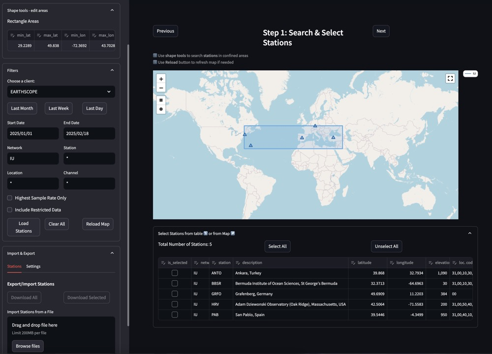
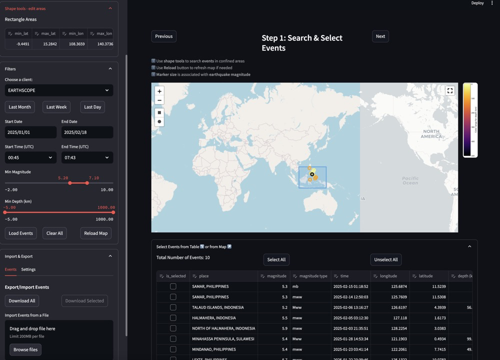
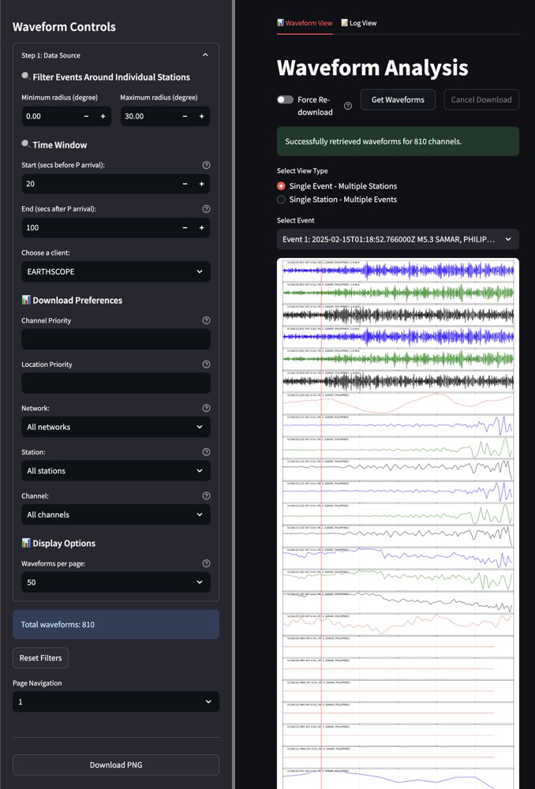

Station Based
============

This workflow begins with selecting seismic stations and then finding events recorded by those stations.

Overview
--------

The Station Based workflow focuses on analyses that start with specific seismic stations of interest. This approach organizes workflows around particular monitoring points, allowing you to study all events recorded at those stations.

Workflow Steps
-------------

1. **Select Stations**: Choose seismic stations based on criteria such as network, location, or operational parameters
2. **Select Events**: Navigate to the events page to find earthquake events recorded by the selected stations
3. **Download Waveforms**: Go to the waveform page to download data for the selected station-event pairs

This workflow is particularly useful for:

* Station-specific studies and calibration
* Regional network analysis
* Long-term station performance evaluation
* Comparing event recordings at specific stations of interest

Step 1: Search & Select Stations
-------------------------------

   
   Station selection interface showing map and filtering options

The station selection interface allows you to search for and select seismic stations using various criteria:

.. include:: ../shared/map_interface.rst
   :start-after: Map Interface
   :end-before: **Rectangle Selection**

**Filtering Options**:
   * **FDSN Client**: Select a data provider (e.g., EARTHSCOPE)

.. include:: ../shared/time_filters.rst
   :start-after: Time Filtering
   :end-before: **Time (UTC) Selection**

   * **Network**: Filter by seismic network code (e.g., IU)
   * **Station**: Filter by specific station codes
   * **Location**: Filter by location codes
   * **Channel**: Filter by channel codes
   * **Additional Options**: 
     * Toggle "Highest Sample Rate Only" to limit results
     * Include restricted data if you have appropriate credentials

.. include:: ../shared/selection_tables.rst
   :start-after: Selection Tables
   :end-before: **Import/Export**

   * Station details shown include network, station code, description, coordinates, and elevation

.. include:: ../shared/selection_tables.rst
   :start-after: **Import/Export**

After selecting your stations, click the "Next" button to proceed to the next step in the workflow.

Step 2: Select Events
------------------

   
After selecting seismic stations, the next step is to choose earthquake events that were recorded by these stations.

The event selection interface for the station-based workflow is similar to the one in the events-based workflow, but with an important difference: the events shown are filtered to only include those that were recorded by the stations you selected in Step 1.

**Event Filtering Options**:
   * **FDSN Client**: Select a data provider (e.g., EARTHSCOPE)
   * **Time Range**: Set a specific date range or use quick options (Last Month, Last Week, Last Day)
   * **Time (UTC)**: Specify start and end times within the selected dates
   * **Magnitude Range**: Use the slider to set minimum and maximum magnitude values
   * **Depth Range (km)**: Use the slider to set minimum and maximum depth values

**Event Selection**:
   * View events in the table that were recorded by your selected stations
   * Select individual events using checkboxes
   * Use "Select All" or "Unselect All" buttons to quickly manage selections
   * Event details shown include location, magnitude, magnitude type, time, coordinates, and depth

After selecting your events, click the "Next" button to proceed to the final step in the workflow.

Step 3: Download & Analyze Waveforms
----------------------------------

   
   Waveform download and analysis interface showing controls and visualization

The waveform download and analysis interface allows you to retrieve, view, and analyze seismic waveform data for your selected stations and events:

.. include:: ../shared/waveform_controls.rst
   :start-after: Waveform Controls
   :end-before: **Retrieval Controls**

**Waveform Analysis**:
   * Toggle between Waveform View and Log View
   * Use "Get Waveforms" button to retrieve data
   * "Force Re-download" option to bypass cache
   * View success messages (e.g., "Successfully retrieved waveforms for 810 channels")
   * Select view type:
     * Single Event - Multiple Stations (shown in screenshot)
     * Single Station - Multiple Events (particularly useful for station-based analysis)
   * Select specific events from dropdown menu
   * View waveform visualizations with color-coded channels
   * Download visualizations as PNG images

**Navigation**:
   * Page through multiple waveforms using the page navigation controls
   * Reset filters to start a new search
   * View total number of waveforms retrieved

This step completes the Station Based workflow, providing you with the waveform data needed for your analysis.

Key Features
-----------

* Station-centric data organization
* Station metadata browsing and filtering
* Event filtering based on station coverage
* Comprehensive station information display
* Multi-station data comparison capabilities 