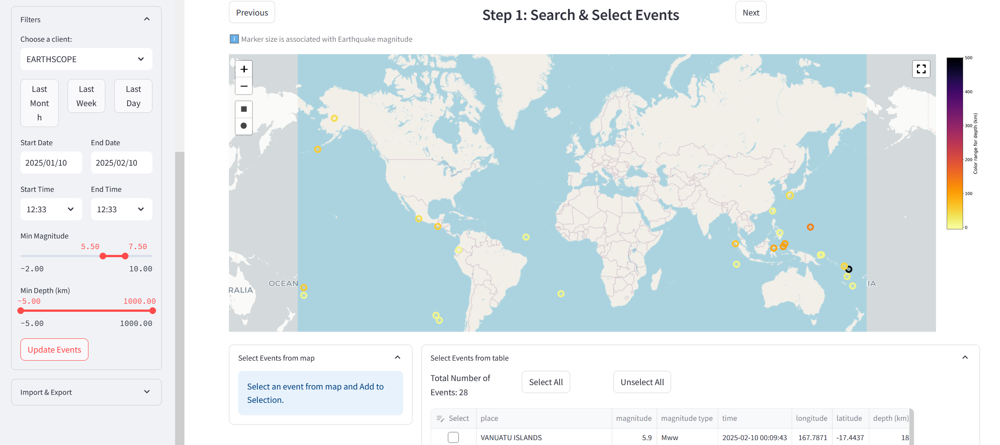

.. Seed Vault documentation master file, created by
   sphinx-quickstart on Fri Feb 14 11:47:19 2025.
   You can adapt this file completely to your liking, but it should at least
   contain the root `toctree` directive.

SEED-vault Documentation
=====================

Welcome to the SEED-vault documentation. SEED-vault is a cross-platform GUI utility for searching, viewing, and downloading seismic data from FDSN servers.

**Seed Vault** is a seismology GUI application that is:

* Open Source, built to service the FDSN community
* Able to access every kind of seismic data
* Designed for expert and novice alike

Features
--------

* Download & view earthquake arrival data via a *station-to-event* or an *event-to-station* search
* Quickly download and archive bulk continuous data, saving your progress along the way
* View and plot event arrivals
* A CLI scripting tool to automate common jobs
* Search, export or import earthquake event catalogs and station metadata
* Download restricted/embargoed data by storing auth passwords in local config
* Add and connect to custom FDSN servers
* Saves all downloaded data as miniseed in a local SDS database to speed up future retrievals
* Local database editor
* Load and save search parameters and configuration
* Can run as a command line application or an unsecured local website

Platforms
~~~~~~~~~

Runs on:

  * Linux
  * Windows
  * MacOS

.. note::

   **This project is sponsored by AuScope: We provide research tools, data, analytics and support to
   Australia's geoscience community. https://www.auscope.org.au/**

   **AuScope is an NCRIS-funded organisation**

   .. image:: _static/images/AuScope_NCRIS_Logo.png
      :width: 400
      :alt: AuScope and NCRIS logos

.. toctree::
   :maxdepth: 2
   :caption: Contents:

   app
   cli
   modules
   
Indices and tables
==================

* :ref:`genindex`
* :ref:`modindex`
* :ref:`search`

