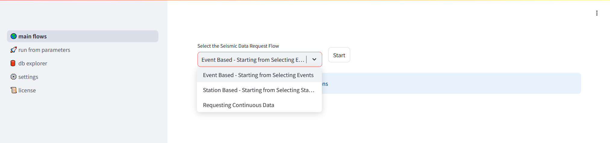
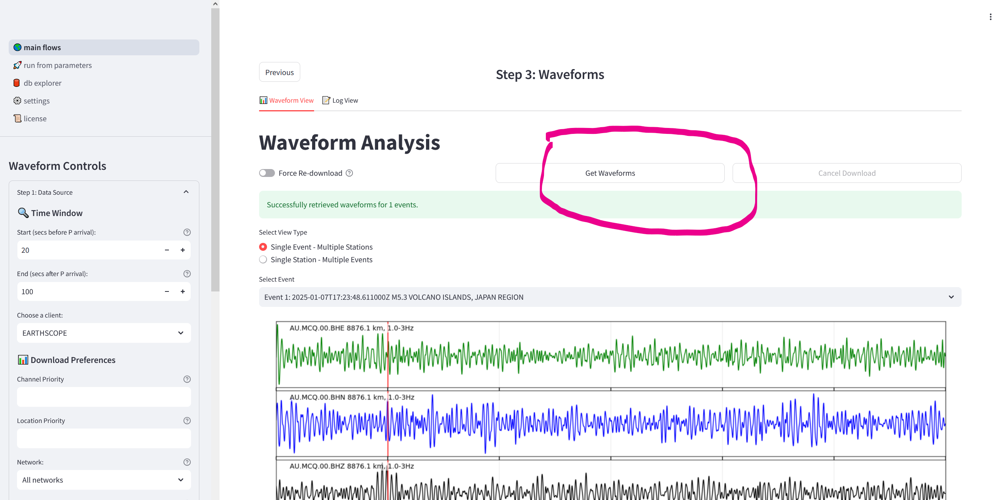
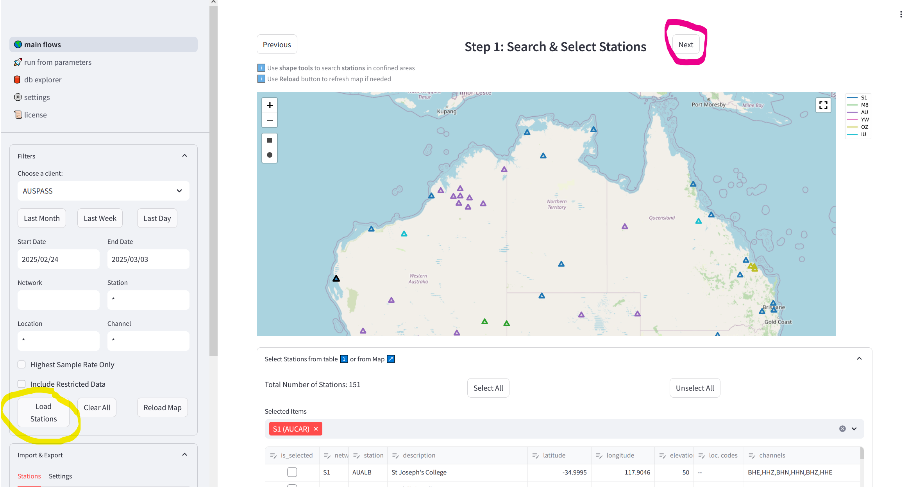
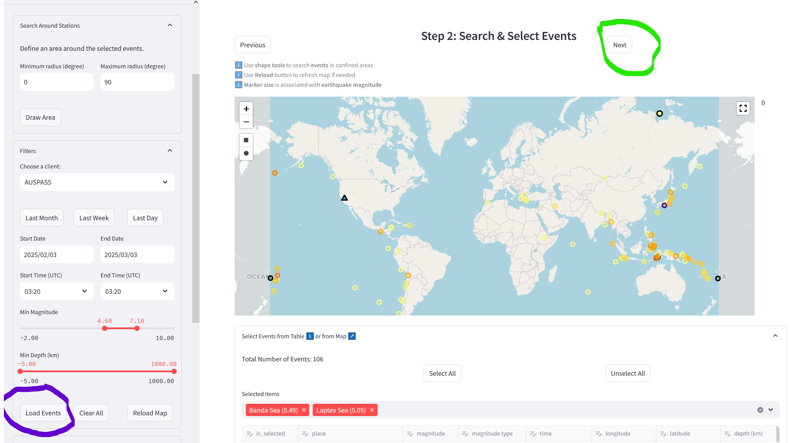
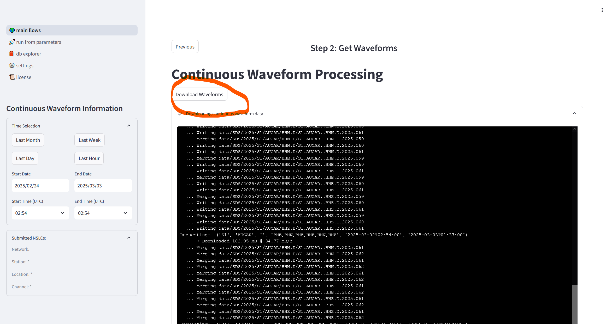

===============
Getting Started
===============

Installation
============

Install via pip (easy way)
--------------------------

.. code-block:: sh

   python3 pip install seed-vault

Install from source (if you insist!)
------------------------------------

Step 1: Clone repository
^^^^^^^^^^^^^^^^^^^^^^^^

.. code-block:: sh

   git clone https://github.com/AuScope/seed-vault.git

Step 2: Setup and run
^^^^^^^^^^^^^^^^^^^^^

Then can build via pip:

.. code-block:: sh

   python3 -m pip install ./seed-vault

Or,

**Linux/MacOS**

.. code-block:: sh

   cd seed-vault
   source setup.sh
   source run.sh

**Windows**

Open a powershell and run following commands:

.. code-block:: sh

   cd seed-vault
   .\setup-win.ps1
   .\run-win.ps1

**NOTES:**

1. For Win OS, you would need to convert the shell scripts to PowerShell. Or simply follow the steps in the shell scripts to set up the app.
2. Requires python3 venv software package e.g. For python v10 on Ubuntu you may need to:

.. code-block:: sh

   sudo apt update
   sudo apt install python3.10-venv

Starting the Application
========================

There are two ways to start the application:

1. Run from script
2. Run as Python library

Run from script
---------------

.. code-block:: sh

   source run.sh

Run as Python Library
---------------------

.. code-block:: sh

   seed-vault

Getting to the Opening Page
===========================

You'll get a message like this:

.. code-block:: sh

   Collecting usage statistics. To deactivate, set browser.gatherUsageStats to false.

   You can now view your Streamlit app in your browser.

   Local URL: http://localhost:8501
   Network URL: http://222.111.001.002:8501
   External URL: http://222.111.001.002:8501

Enter a URL into your brower, and you should see the opening page:

From here you can select one of three options, then hit the "Start" button:

* A. Event based
* B. Station based
* C. Continuous Data

i. Event Based Workflow
=======================

"Step 1: Search & Select Events" Page
-------------------------------------

.. image:: _static/images/step1-select-events.png

1. Hit the "Load Events" button (circled in green)
2. Select events from the map and/or directly in the table 
3. Hit the "Next" button (circled in orange)

"Step 2: Search & Select Stations" Page
---------------------------------------

.. image:: _static/images/step2-select-stations.png

1. Hit the "Load Stations" button (circled in orange)
2. Select stations from the map and/or directly in the table
3. Hit the "Next" button (circled in green)

"Step 3: Waveforms" Page
------------------------

1. Click on the "Get Waveforms" button (circled in pink)

ii. Station Based
=================

"Step 1: Search & Select Stations" Page
---------------------------------------

1. Hit the "Load Stations" button (circled in yellow)
2. Select stations from the map and/or directly in the table
3. Hit the "Next" button (circled in pink)

"Step 2: Search & Select Events" Page
-------------------------------------

1. Hit the "Load Events" button (circled in purple)
2. Select events from the map and/or directly in the table
3. Hit the "Next" button (circled in green)

"Step 3: Waveforms" Page
------------------------

1. Click on the "Get Waveforms" button (circled in pink)

iii. Continuous Downloads
=========================

"Step 1: Search & Select Stations" Page
---------------------------------------

1. Hit the "Load Stations" button (circled in yellow)
2. Select stations from the map or directly in the table
3. Hit the "Next" button (circled in pink)

"Step 2: Get Waveforms" Page
----------------------------

Hit the "Download Waveforms" button, wait for download to complete

